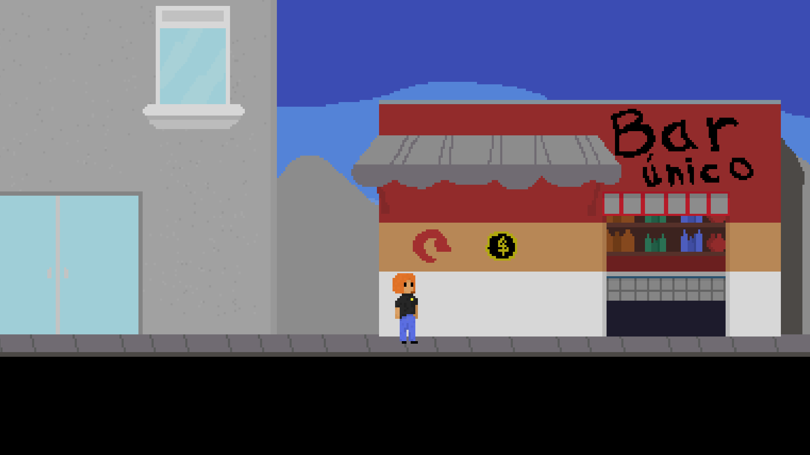

# Caso Moretti

Um caso negligenciado de feminicídio que precisa ser resolvido. O jogador assume o papel de investigador e deve coletar evidências, entrevistar testemunhas e desvendar pistas para desvendar a verdade por trás do crime e trazer justiça à vítima. O jogo é baseado em fatos reais e visa sensibilizar o público sobre a importância de combater a violência contra as mulheres e promover a igualdade de gênero. Ele oferece uma jogabilidade envolvente e uma história emocionante, além de trazer uma mensagem importante para o público.

## Objetivo do desenvolvimento do jogo

Este jogo foi desenvolvido com o intuito de ser submetido a avaliação final do 2° semestre, do curso de Jogos Digitais no IFBA - Lauro de Freitas. Tendo como norteamento o tema transversal os Direitos Humanos, com o enfoque no **feminicídio**.

## Link para Download:
**https://gustadimas.itch.io/caso-moretti**

## Imagens do jogo

- **Menu inicial**
  

- **Primeira Tela**
  - Apartamento da vítima, onde ocorreu o assassinato.
  

- **Apartamentos do Prédio Principal**
  - Dois velhinhos, moradores do prédio estão ao lado de fora, o jogador pode interagir com eles.

- **Cidade**
  - O jogador está na cidade e pode entrar em determinados locais.

- **Puzzle Bar**
  - Um dos puzzles que o jogador precisa resolver para adquirir informações.

- **Mercadinho**
  - Um dos locais em que o jogador pode encontrar pistas.

- **Puzzle Mercadinho**
  - Um latão de lixo, será que tem algo em baixo desse lixo todo?

- **Créditos**
  - Todos os desenvolvedores e orientadores do projeto.

## Tecnologias utilizadas

- **Unity (Game Engine)**
- **Aseprite (Software de Pixel Art)**
